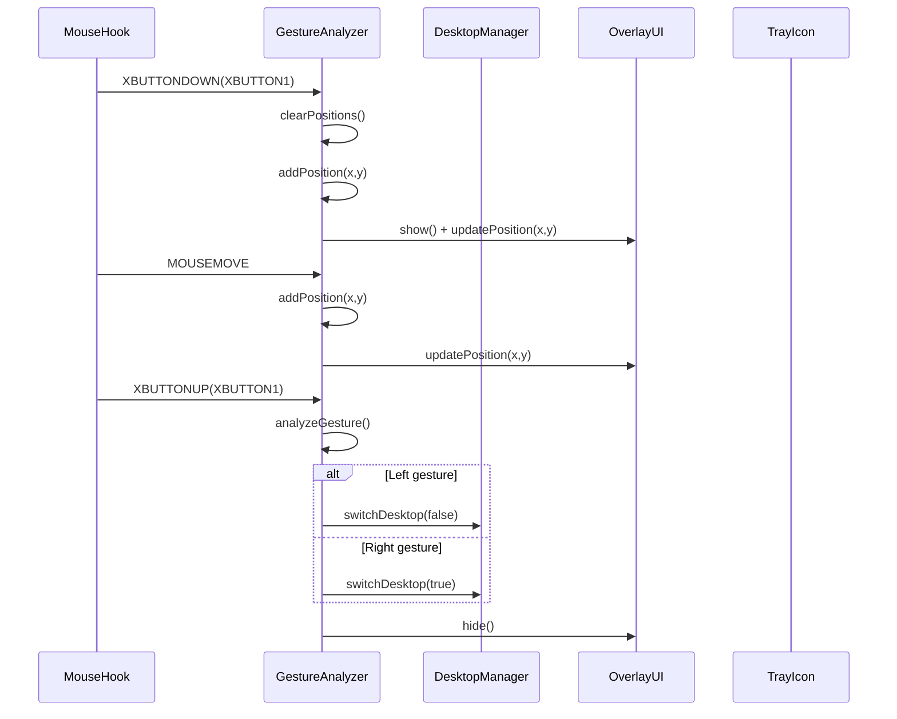

# 鼠标侧键虚拟桌面切换器架构设计

## 1. 总体架构
采用分层架构设计，分为以下核心模块：
- 输入监听层 (MouseHook)
- 业务逻辑层 (GestureAnalyzer) 
- 桌面控制层 (DesktopManager)
- 用户界面层 (OverlayUI, TrayIcon)
- 配置管理层 (Settings)

## 2. 模块详细设计

### 2.1 输入监听层
- **MouseHook模块** (Singleton模式)
  - 职责：使用Windows Hook API捕获鼠标侧键事件(XBUTTON1)和移动轨迹
  - 技术：SetWindowsHookEx(WH_MOUSE_LL)实现低级鼠标钩子
  - 特性：支持多个回调函数注册，事件分发机制
  - 输出：标准化的鼠标事件数据(WPARAM, LPARAM)

### 2.2 业务逻辑层
- **GestureAnalyzer模块**
  - 职责：分析鼠标滑动轨迹，检测手势方向
  - 算法：基于移动向量分析，最小滑动距离阈值(50像素)
  - 输出：Direction枚举(Left/Right/Up/Down/None)
  - 特性：支持手势进度状态跟踪

### 2.3 桌面控制层
- **DesktopManager模块**
  - 职责：虚拟桌面切换操作
  - 技术：模拟Win+Ctrl+左右方向键组合
  - 功能：单方向桌面切换(true=右, false=左)
  - 特性：遵循Rule of Five原则，禁用拷贝和移动操作

### 2.4 用户界面层
- **OverlayUI模块**
  - 职责：使用Direct2D渲染手势轨迹可视化
  - 技术：Direct2D工厂模式，HWND渲染目标
  - 特性：可配置颜色和样式，支持实时更新

- **TrayIcon模块**
  - 职责：系统托盘图标管理和通知显示
  - 技术：Shell API (NOTIFYICONDATAW)，自定义窗口过程
  - 功能：动态菜单项管理，气泡通知显示
  - 特性：支持回调函数注册，资源自动清理

### 2.5 配置管理层
- **Settings模块**
  - 职责：JSON配置文件持久化管理
  - 存储：config.json文件，使用nlohmann/json库
  - 功能：手势灵敏度配置，覆盖层颜色设置
  - 特性：热重载支持，类型安全的数据访问

## 3. 核心交互流程

## 4. 技术栈特性
- **C++标准**: 遵循C++17标准，使用现代C++特性
- **设计模式**: 
  - Singleton (MouseHook)
  - Observer (MouseHook回调)
  - RAII (资源管理)
- **Windows API扩展**:
  - ShellScalingApi.h (DPI感知)
  - Shlwapi.h (路径操作)
  - 链接库: shlwapi.lib
- **初始化保障**:
  - 组件初始化失败立即终止
  - 配置文件自动生成机制