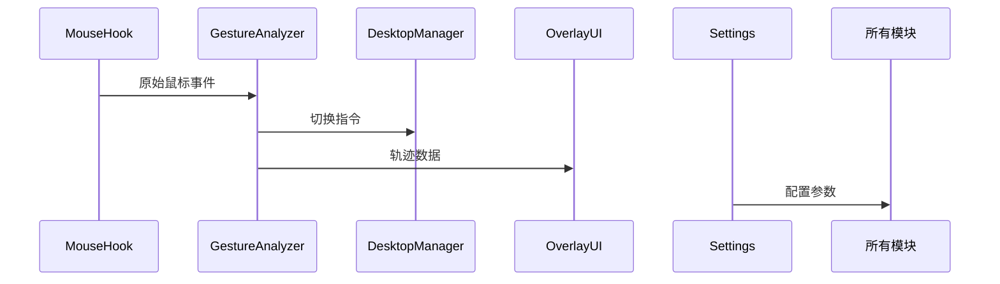

# 鼠标侧键虚拟桌面切换器架构设计

## 1. 总体架构
采用分层架构设计，分为以下核心模块：
- 输入监听层
- 业务逻辑层
- 桌面控制层 
- 用户界面层
- 配置管理层

## 2. 模块详细设计

### 2.1 输入监听层
- **MouseHook模块**
  - 职责：捕获鼠标侧键事件和移动轨迹
  - 技术：Windows Hook API
  - 输出：标准化鼠标事件数据

### 2.2 业务逻辑层
- **GestureAnalyzer模块**
  - 职责：分析滑动方向和幅度
  - 算法：移动向量分析
  - 输出：切换指令(L/R)

### 2.3 桌面控制层
- **DesktopManager模块**
  - 职责：虚拟桌面操作
  - 技术：模拟按键操作
  - 功能：枚举/切换桌面

### 2.4 用户界面层
- **OverlayUI模块**
  - 职责：显示滑动轨迹
  - 技术：Direct2D绘制
  - 特性：半透明/可配置样式

### 2.5 配置管理层
- **Settings模块**
  - 职责：持久化配置
  - 存储：JSON配置文件
  - 功能：热重载配置

## 3. 组件交互流程
